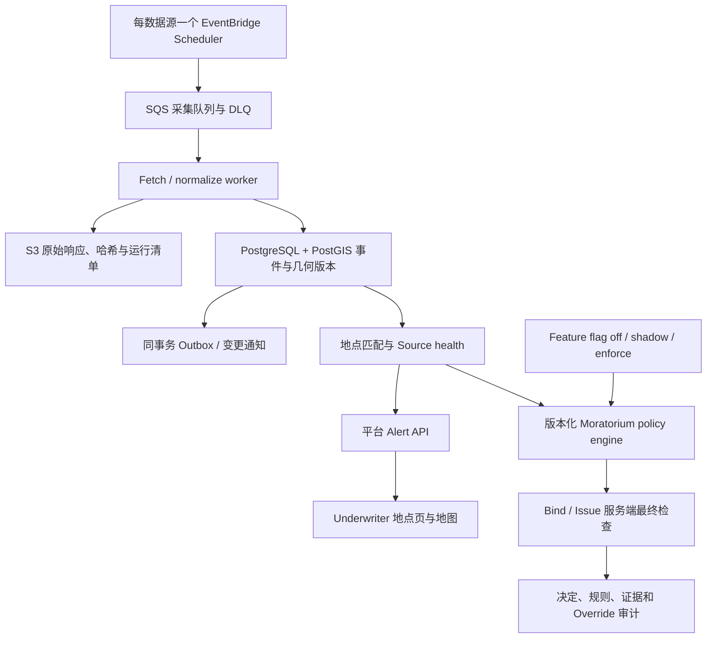

# 美国商业财产险 Hazard Alert 与 Moratorium 方案

设计与实测日期：2026-09-14。默认范围为美国 50 州及 DC，海外领地通过产品配置扩展。没有创建 AWS 资源，没有部署服务，没有修改任何产品开关、费率或承保规则。代码是可运行的数据可行性原型；下文明确区分已验证的 ETL 与尚待实施的业务系统。

## 建议决策

建立独立的 **hazard data service**，将官方消息规范化为可追溯事件，再由 **location matching service** 判断某个投保地点与这些事件的关系。Alert 第一阶段先给 underwriter 提示，不直接改价或停保；第二阶段叠加经过审批的 moratorium policy engine，在 bind、issue 和指定 endorsement 动作中执行。

Alert 阶段也需要后端：它负责集中采集、缓存、证据版本、空间匹配、访问控制和数据时效。第一阶段可以不改现有 rating/bind 引擎，但浏览器应读取平台 API，而不是各自抓取政府数据。这会让不同 underwriter 看到一致的判断，也让后续后端决策可审计。

实时灾害支持短期 appetite、人工转审和暂缓承保；**不应把 alert severity 直接转换成 rating multiplier**。长期 rating 另外依赖历史频率/强度、建筑结构和 roof 特征、occupancy、保障条件、限额、损失经验及产品批准的模型。保留事件历史是未来研究的输入，不能把当前 feed 当成已经完成验证的风险模型。

## 一、纳入哪些 hazard

首批保留以下类别。类别和产品保障应分开：即使产品不承保 flood，underwriter 仍可能需要了解营业中断、已发生损失或其他关联风险，但 UI 不应暗示这些损失一定承保。

1. **Tornado、severe convective storm**：龙卷风、破坏性风和冰雹。NWS Tornado/Severe Thunderstorm Watch/Warning。普通 thunderstorm warning 可能由风或冰雹任一条件触发，默认保留组合类别，不凭一个 warning 同时确认 hail 与 wind。
2. **Tropical cyclone、extreme/high wind**：NWS 地方警报 + NHC 气旋/风圈背景。飓风相关 wind、storm surge、降雨洪水各自独立分类，关联同一 cyclone。
3. **Flash flood、river flood、coastal/lakeshore flood、storm surge**：NWS 为区域主源，NWPS 作观测/预报补充。Gauge 水位不是建筑积水深度。
4. **Wildfire**：NIFC/WFIGS 已知 fire incident/perimeter。NWS Red Flag/Fire Weather Watch 单列为 `fire_weather`，表示危险天气条件，不表示已经起火。
5. **Winter storm、ice、blizzard/heavy snow**：适合屋顶积雪荷载、冰损、冻损、供电和营业中断提示。Snow squall 主要与交通相关，保留为低优先可配置项。
6. **Freeze/extreme cold**：作为冻管等损失的筛查信号。气象 freeze 产品本身不是建筑内部温度或冻管损伤判定，需要 occupancy、供暖/防冻和空置情况。
7. **Earthquake**：USGS 已发生事件；ShakeMap 提供模型估计的地面震动。M2.5 是本原型采集门槛，不是承保或损伤阈值。
8. **Tsunami、ashfall**：已有 NWS CAP 分类，适用于西海岸、AK、HI 等暴露。本次实时样本没有证明这些类别发生了事件；分类代码覆盖不等于逐灾種的现场验证。火山 lava 等更细范围需要另接 USGS volcano products。

默认不把 marine/small craft、rip current、dense fog 等航海/人身产品加入普通陆上 commercial property 告警。Heat、drought、smoke/air quality、dust、landslide 按业务用途与保障扩展，先不把所有公共安全产品都映射为财产险风险。NWS severe convective 警报不能完整覆盖所有雷击；本轮不声称建立了全国免费雷击定位系统。

## 二、数据源和调度

以下间隔是**平台轮询建议**，不是上游更新 SLA，也不是端到端时延承诺。

- **NWS CAP**：`https://api.weather.gov/alerts/active?status=actual`，每 **60 秒**。同源滑动增量 `/alerts?start=...` 处理 update/cancel，持久化成功水位并重叠回补。官方建议不快于每 30 秒请求；公司集中抓取，不按用户重复请求。NWS 提供近七日历史，超出窗口的中断不能假装已经补齐。[NWS alerts](https://www.weather.gov/documentation/services-web-alerts)、[API geolocation guide](https://www.weather.gov/media/documentation/docs/NWS_Geolocation.pdf)
- **NHC**：`https://www.nhc.noaa.gov/CurrentStorms.json`。活跃期每 **5 分钟**检查，无活跃气旋可降到 **30 分钟**；只下载版本变化的 GIS 产品。常规公告通常每六小时，但可能有特别更新。本原型验证中心点、cone、track、initial wind、forecast wind KMZ；概率、到达时间、potential surge 栅格尚未 ETL。NWS Storm Surge Watch/Warning 已覆盖第一阶段的主告警入口。[NHC product examples](https://www.nhc.noaa.gov/productexamples/)、[NHC graphics](https://www.nhc.noaa.gov/aboutnhcgraphics.shtml)
- **NIFC/WFIGS**：current incidents 和 interagency perimeters。建议每 **5 分钟**检查 ID/修改版本，边界增量下载；**每天一次完整对账**。资源较小的初版可以每 15 分钟。不能每 5 分钟重复下载所有大多边形：本次完整响应约 37.6 MB，288 次约 10.8 GB/天，仅用于说明优化必要性，不是 AWS 费用估算。[Incidents REST](https://services3.arcgis.com/T4QMspbfLg3qTGWY/arcgis/rest/services/WFIGS_Incident_Locations_Current/FeatureServer/0)、[Perimeters REST](https://services3.arcgis.com/T4QMspbfLg3qTGWY/arcgis/rest/services/WFIGS_Interagency_Perimeters_Current/FeatureServer/0)
- **USGS earthquakes**：`2.5_day.geojson` 每 **60 秒**。新事件按需取 detail/ShakeMap，按产品 revision 更新；建议已跟踪地震在首小时每分钟、随后一天每 5 分钟检查，之后按业务窗口复查。每日长窗口/catalog 回补是生产补项，不能让 past-day 滚出等价于灾害结束。[USGS GeoJSON](https://earthquake.usgs.gov/earthquakes/feed/v1.0/geojson.php)、[USGS Detail](https://earthquake.usgs.gov/earthquakes/feed/v1.0/geojson_detail.php)
- **NOAA NWPS**：inventory/status 每 **15 分钟**，portfolio 相关重点站每 **5–15 分钟**；metadata 每天。按 basin/区域切片或指定 gauge，避免单次全国请求。本次全国请求超时，区域样本与单站接口成功；因此 NWPS 全国覆盖尚未验证。[NWPS API](https://api.water.noaa.gov/about/api)
- **FEMA OpenFEMA disaster declarations v2**：建议每 **60 分钟**，作为行政声明、灾后上下文与审计补充。本轮只研究定位，**未实现 FEMA adapter**。声明时点可能晚于灾害，不适合当即时触发主源。[FEMA dataset](https://www.fema.gov/openfema-data-page/disaster-declarations-summaries-v2)
- **SPC outlook、WPC excessive rainfall、USGS volcano、FEMA flood maps/NRI**：作为后续预测或静态底图扩展，不在本轮完成清单。FEMA NRI 是长期风险背景，不是当前灾害流。[FEMA NRI technical documentation](https://www.fema.gov/sites/default/files/documents/fema_national-risk-index_technical-documentation.pdf)

所有已实现来源都无需付费 API key。本次未假定某个保险公司在使用这些数据，也未把第三方转发源标成官方。美国影响范围最终依据 property 与影响范围匹配；海上 cyclone、加拿大/墨西哥地震可以影响美国，不能因为中心点不在美国就丢弃。

## 三、AWS 设计：数据与业务决定分层

初版可以 Scheduler → Lambda，先保留相同任务接口和原子发布逻辑；负载增加后加 SQS 分片。Scheduler 有 60 秒触发精度，关键任务关闭 flexible time window；每分钟调度不意味着任意灾害都在 60 秒内显示。[AWS Scheduler](https://docs.aws.amazon.com/scheduler/latest/UserGuide/schedule-types.html)

普通 Lambda 最长 900 秒。过大的 wildfire geometry、批量边界同步和耗时回补可拆分或用 ECS Fargate；不要把等待下次轮询写进函数。SQS/Lambda 可能重复投递，每源需要运行锁/lease和幂等唯一键，失败进入 DLQ，不能用失败的半份快照替换当前版本。[Lambda timeout](https://docs.aws.amazon.com/lambda/latest/dg/configuration-timeout.html)、[SQS/Lambda processing](https://docs.aws.amazon.com/lambda/latest/dg/with-sqs.html)

S3 保存不可变原始文件，PostGIS 服务当前查询和空间索引，outbox 只发布数据库已提交的变化。若当前业务数据库不是 PostgreSQL，可独立建 hazard 数据库，无需替换现有保单库。公网数据抓取、VPC 私有数据库连接、NAT/endpoint、连接池和 RDS 基础费用需要根据现有 AWS 网络设计核算；免费数据不意味着运行服务免费。[RDS extensions](https://docs.aws.amazon.com/AmazonRDS/latest/UserGuide/Appendix.PostgreSQL.CommonDBATasks.Extensions.html)

不先引入 OpenSearch、全站 WebSocket 或复杂流式平台。前端每 60 秒带 ETag 读平台 API 足够起步；portfolio 很大时预计算受影响地点、批量失效缓存，再考虑 SSE 更新当前页面。

## 四、数据模型与清洗

统一事件契约保留以下几组字段，避免将不同源的含义压成一个不可解释的 risk score：

- **身份与版本**：`source`、`source_record_id`、source payload hash、schema/parser version、`run_id`、原始 URI/hash。原型 SQLite `revisions` 保留不可变内容版本，`events` 保留当前查询行。
- **险因**：`hazard_types[]`、`source_event` 原名、`headline`、`description`、`source_url`。源内唯一事件与跨源事件聚合分开；NWS/NHC 同属一个 storm 不代表可以删掉其中的风暴潮告警。
- **时间**：`issued_at`、`source_updated_at`、`effective_at`、`expires_at`、`onset_at`、`event_ends_at`；run 中记录取数/完成时间。CAP message expires 与灾害预计 ends 必须分开；不使用 `ends` 延长已经过期的消息，也不使用未来 onset 隐藏已生效的 Watch。[NWS CAP documentation](https://vlab.noaa.gov/web/nws-common-alerting-protocol/cap-documentation)
- **状态与证据**：source lifecycle、`evidence`、native severity、certainty/urgency、quality flags。`observed`、`forecast`、`radar_indicated`、`potential`、`unknown` 分开。原型中 NHC 分析风圈使用 unknown 加明确分析标记；生产可扩展独立 `analyzed` 枚举。
- **空间**：WGS84 longitude/latitude GeoJSON、`geometry_role`、区域编码、geometry 观测时间。经纬度不是米；county/FIPS 保留前导零；NWS UGC 的 county 与 forecast/fire zones 分开。原型只做坐标范围、环闭合/长度和来源特定退化检查；生产仍须拓扑有效性、自交、跨日界线与 geometry repair 前后比对。
- **源专属指标**：NWS CAP parameters/VTEC；NHC kt、hPa、advisory version；NIFC acres、containment_percent、out time、perimeter timestamp；USGS magnitude type、depth_km、MMI/PGA原始单位；NWPS primary/secondary value/unit、PEDTS、stage datum。不要把一个来源的 severity 与另一个来源的颜色等级强行统一。

空值保持 null，不用 0 替代未知；NWPS sentinel 数值与 0001 年时间转 null，有效负水位保留。HTML/KML metadata 仅作文本，不在前端当 HTML 执行。超过下载体积/分页上限、缺字段或非法 geometry 有可审阅的异常记录。

NWS 原始 polygon 优先，缺失时解析全部 affectedZones。实测批量 include_geometry 返回空，已有单 zone fallback；任一 zone 缺失时不能输出局部合并范围冒充完整范围。生产版应把 zone 作为版本化静态维表缓存，以免每分钟重复抓 100 多个边界。

## 五、储存、幂等与恢复

S3 建议路径：`source/YYYY/MM/DD/run_id/sha256.ext.gz`，旁边存 manifest（URL、参数、HTTP 状态、ETag、源时间、拉取时间、字节数、哈希、分页数、schema版本、完整性）。304 可引用旧对象并记录成功检查，不必复制大文件。建议热查询留近90天，完整变化版本至少覆盖一个完整灾害季；具体多年审计保留由公司记录政策决定。

PostGIS 包括 ingestion_run/source_health、event_revision/current、event_geometry、boundary_version、location_match，第二阶段增加 policy_revision、decision_audit、override、outbox。结构示例见 `production_schema.sql`，只提供设计，没有执行。

原型实际将 raw、normalized JSONL、quarantine、manifest 写到本地，SQLite 保存 run/state/revision/current/supersession。失败或 partial 运行保留证据但不发布 current；旧状态仍在，source_state 显示 failed/partial。完整新快照中消失的记录仅标 `missing_from_latest_snapshot`，不据此解除 moratorium。较早修订不能覆盖较晚记录，重复输入不重复建立 revision。

NWS 处理显式 update/cancel 的 references，并从上次成功时间带重叠回补；超七日历史缺口会打标。USGS 当前 feed 的滚动窗口、NIFC current 的清除规则均使“消失”不能代表“已结束”。生产还需长期 catalog reconciliation、source-specific tombstone处理和被业务决定引用事件的长期跟踪。

## 六、地点匹配与前端交互

输入优先是已校验的 building point 或 footprint，并保存位置版本、精度、geocoder 信息；ZIP centroid 不满足精确自动停保。Polygon 与点/建筑面使用 PostGIS `ST_Intersects`，边界点也纳入。距离筛查使用 geography/合适投影的米，AK 跨日界线要专门处理。[ST_Intersects](https://postgis.net/docs/en/ST_Intersects.html)

建议返回匹配类别：`within_warning_area`、`within_observed_perimeter`、`within_forecast_area`、`near_observed_point`、`no_match_in_covered_data`、`unknown`。震中和火点可以提示附近事件，但不能作为 polygon 命中；NHC cone 不能作为 damaging wind 范围；gauge 点不能作为 inundation 范围。公司若定义距离 buffer，必须标记为 `derived_buffer` 并保存阈值与审批版本。

Alert API 设计：

- `GET /v1/locations/{locationId}/hazard-alerts?as_of=...`：返回 location版本、匹配event revision、source health、coverage范围、未知项、snapshot版本和时间；租户鉴权复用平台。
- `GET /v1/hazard-events/{id}`：来源、原始文本、版本链、证据、几何角色及时间。
- `GET /v1/hazard-map?bbox=...`：仅展示授权区域、缩放级别所需的地图几何；显示简化几何不用于后端 bind 判断。
- `GET /v1/hazard-source-health`：全局/指定范围的 freshness、missing shards、last success。

Underwriter 地点页显示 hazard、Watch/Warning/Observed 标签、有效窗口、是否官方 polygon 或粗 zone、上游发布时间、最后成功检查时间、业务影响（信息提示/转审/已批准moratorium）。事件源失联时显示“数据未能更新”；当前有效范围无匹配时显示“已覆盖数据中未匹配到有效预警”，避免“安全/无灾害”。

UI 初始 load 与地址/产品/coverage 变化时重新查询；页面在前台每60秒刷新，可在切回页面时即时刷新。前端确认/ack只代表看过提示，不代表承保授权；不得让关闭告警弹窗解除规则。

## 七、Moratorium 与后端 flag

**Feature flag 是启用模式，moratorium 是业务政策。** 建议产品开关包含：`hazard_alerts_enabled`、`moratorium_mode=off|shadow|enforce`；实际规则另存版本，不把动态灾区 polygon 全部塞入一个布尔开关。

每条 policy 定义：product/coverage/state scope、location几何或匹配条件、hazard/evidence允许范围、transaction types、effective time、review/expiry time、outcome、审批人、理由、数据源要求和解除规则。动作至少区分 new business、quote、bind、issue、增加地点、提高限额、renewal；不要把一个停保布尔值无差别阻断所有交易。

例如：经审批的 policy 可以要求某商业财产产品在某时间窗口，对指定 polygon 内新增 wind exposure 的 bind 返回 `BLOCK`；同一地点的 quote 仍可 `REFER` 并说明原因。这个例子只是策略结构，不是本轮制定的全国停保标准。

后端 `POST /v1/underwriting-decisions/evaluate` 接收交易类型、产品/保障/限额版本、locations版本、计划生效日、idempotency key，返回 `ALLOW/REFER/BLOCK/UNKNOWN`、policy版本、事件revision、data health、理由、评估时间与短期有效性。

bind/issue 真正提交前必须检查：地点/产品是否变化、policy版本是否变化、source snapshot是否仍满足要求、decision是否过期。将评估与业务写入通过事务边界或版本compare-and-recheck保护，避免 quote 页面显示允许后新规则已经生效仍成功bind。异步回调、批量上传、经纪API等所有入口均调用同一个 gate。客户端提交的 flag 或截图不能作为授权。

shadow 模式记录“如果enforce会怎样”，仍按照现有业务规则运行；enforce 才执行批准政策。数据未知时，已生效的block不因源故障自动解除；没有既有block但必须判断的交易可根据已批准策略转人工/暂停，不能默默ALLOW，也不要由技术团队擅自全美国停保。

审批流程：候选事件 → 承保人审阅影响范围/产品 → policy approved → active → review_due → released/expired。source alert expired 与 policy released 分开；自动expiry只能执行公司事先批准的TTL/解除条件，并有明确未知数据处置。Override限定地点、交易、授权人、理由、截止时间，审计且后端校验。监管要求的不得cancel/nonrenew与公司暂停new-business的moratorium需分域管理，不能沿用同一动作含义。

## 八、时效与运维验收

起步建议：NWS/USGS完整采集超过3分钟无成功→degraded，超过10分钟→stale；活跃NHC超过30分钟无法成功检查→stale；wildfire超过60分钟无法成功检查→stale。NHC公告几小时没变化可能正常；wildfire几分钟前下载但perimeter三天没更新仍属旧边界。源的可连接性、快照完整性、单记录时间、geometry时效、scope覆盖必须分别显示。

CloudWatch监控 fetch延迟、HTTP错误/限流、零记录异常、schema异常、quarantine数、区域解析覆盖率、分页完整性、最后完整快照、queue age、DLQ与rule evaluation失败。记录数突然为零不能仅因HTTP200就自动判定全国clear。后续需依源运行基线配置异常阈值；本原型保留计数，尚未实现自动基线告警。

上线前分三阶段验收：

1. **数据与可见告警**：将现有已定位的portfolio接入；覆盖50州/DC及明确的territories；zones维表、US边界、日期变更线与unknown处理通过；异常/重复/旧版本/断网/cancel回放通过。
2. **Shadow**：选产品并行运行，按实际案件评估误报、漏报、匹配精度和人工处理量；由underwriting定义触发/释放与override权限。数据层ETL成功不能替代业务验收。
3. **Enforce**：所有bind/issue入口接gate，审计与版本一致性通过；从小范围产品开始，保留回到shadow的模式切换及已生效policy的明确处理。

本次已完成官方数据的读取/标准化/留存/基本质量校验和本地版本存储。**尚未实施**AWS部署、真实前后端API、portfolio geocoding/全国建筑匹配、生产PostGIS拓扑/边界库、来源长期历史回补、完整灾季回放、rate模型或moratorium规则执行。这些是实施阶段工作，不是被本次样本验证隐含证明的能力。

详细运行数字见 `数据验证.md`；源专属研究见 `../research/`；运行方法见 `../README.md`。
